# SaaS Security Audit Readiness Project

## Company Scenario
CloudTaskr is a fictional SaaS company that provides project management software to small businesses.

## Audit Objective
Prepare for a simulated SOC 2 and NIST-aligned security audit by reviewing key security controls, collecting evidence, identifying gaps, and documenting remediation recommendations.

## In Scope
- SaaS web application
- Cloud hosting environment
- Identity and access management
- Employee access controls
- Logging and monitoring
- Incident response process
- Vendor/security policy documentation
- Data protection practices

## Out of Scope
- Physical office security
- Payment card processing
- Source code review
- Mobile application security

## Framework Mapping
- SOC 2 Trust Services Criteria: Security, Availability, Confidentiality
- NIST CSF 2.0: Govern, Identify, Protect, Detect, Respond, Recover

## Assumptions
This is a simulated audit lab using mock evidence, screenshots, sample policies, and manually created audit documentation.

## Step 1: Audit Scope and Project Setup

Defined the scope of a simulated SaaS security audit aligned with SOC 2 and NIST CSF 2.0. Created the project repository structure to organize audit evidence, screenshots, policies, risk documentation, and workpapers.

### Screenshots

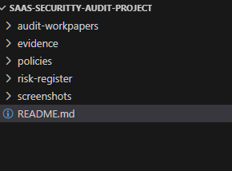

## Step 2: Access Control Review

Reviewed identity and access management controls for SaaS platforms to validate alignment with SOC 2 logical access requirements and NIST CSF identity management controls.

Performed a review of:
- MFA enforcement
- Active sessions/devices
- Account recovery settings
- Security configuration settings

Collected evidence demonstrating implementation of basic access security controls and documented findings in an audit workpaper.

### Screenshots

## Step 3: Logging and Monitoring Review

Performed a review of security logging and monitoring controls to evaluate the organization’s ability to detect suspicious activity and support incident investigations.

Reviewed:
- Authentication logs
- Security events
- Account activity history
- MFA-related events

Collected evidence demonstrating audit trail visibility and documented monitoring procedures aligned with SOC 2 and NIST Detect controls.

### Screenshots

## Step 4: Asset Inventory Review

Performed a review of organizational assets and SaaS dependencies to support governance, risk management, and audit readiness activities.

Created and reviewed:
- SaaS asset inventory
- Criticality classifications
- Ownership assignments
- Sensitive data identification

Documented findings and recommendations aligned with SOC 2 and NIST asset management practices.

### Screenshots

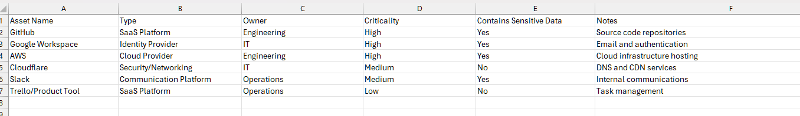

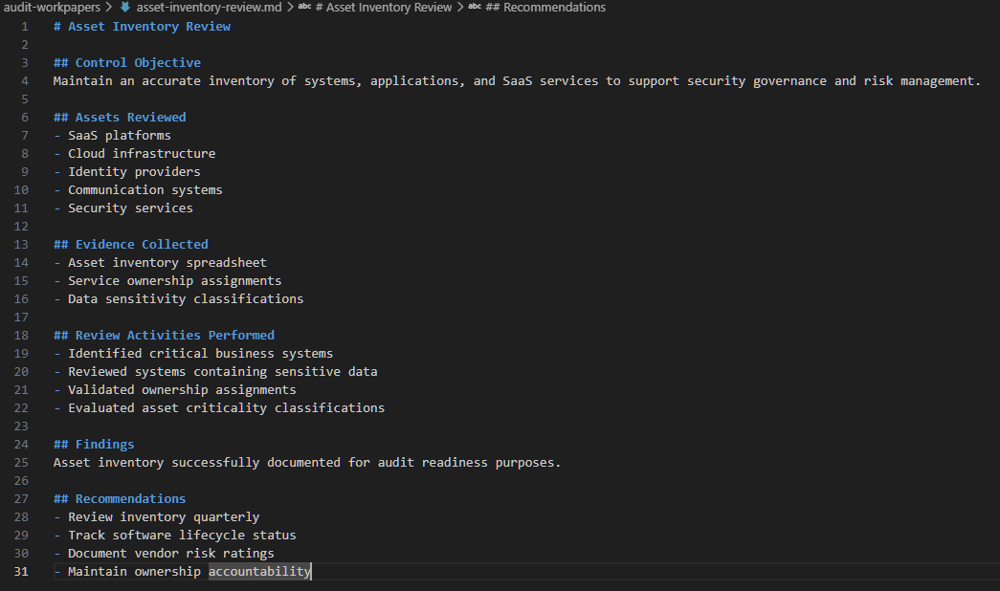

## Step 5: Risk Assessment Review

Conducted a simulated cybersecurity risk assessment aligned with SOC 2 and NIST CSF risk management practices.

Created and reviewed:
- Organizational risk register
- Risk likelihood and impact ratings
- Mitigation tracking
- Ownership assignments

Documented security and operational risks affecting the SaaS environment and identified remediation recommendations to improve audit readiness.

### Screenshots

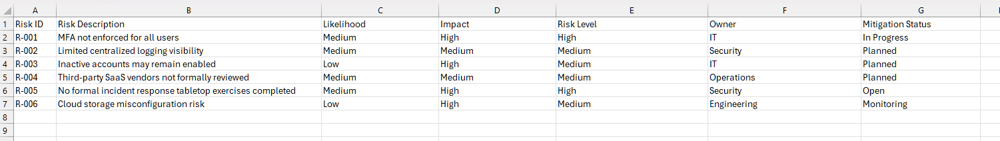

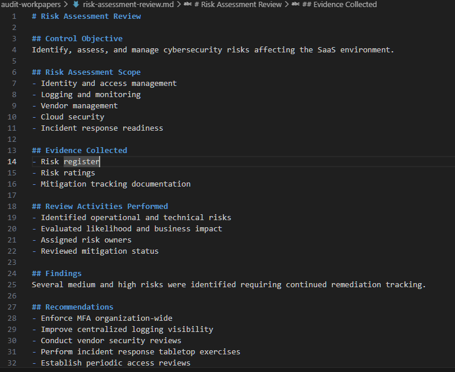

## Step 6: Vulnerability Management Review

Performed a vulnerability management and patch review aligned with SOC 2 and NIST platform security controls.

Reviewed:
- GitHub Dependabot vulnerability alerts
- Dependency security findings
- Patch management visibility
- Software supply chain exposure

The review identified numerous dependency vulnerabilities within a SaaS code repository, demonstrating realistic software security risks commonly encountered during audit and security assessment activities.

Documented remediation recommendations and mitigation strategies to improve vulnerability management maturity and reduce attack surface exposure.

### Screenshots

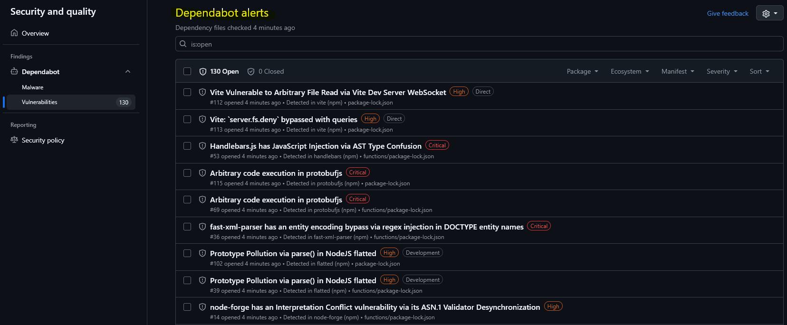

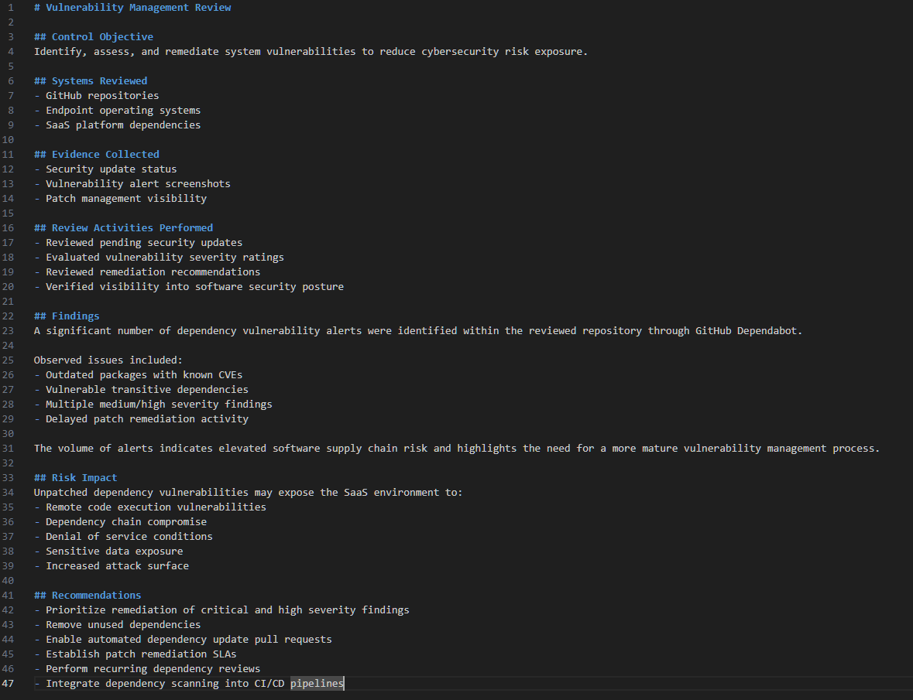

## Step 7: Security Policy and Governance Review

Performed a governance and policy documentation review aligned with SOC 2 and NIST governance controls.

Created and reviewed:
- Access Control Policy
- Incident Response Policy
- Acceptable Use Policy

Documented governance requirements, security responsibilities, and organizational control expectations to support audit readiness activities.

### Screenshots

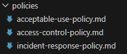

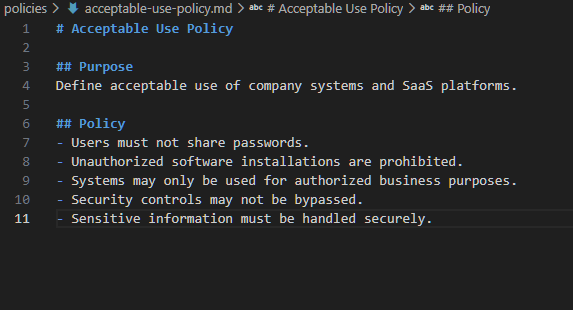

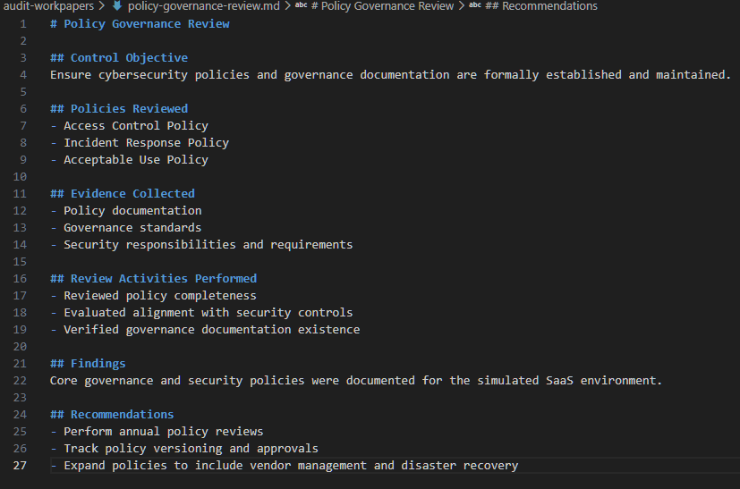

## Step 8: Incident Response Readiness Review

Performed a simulated incident response exercise aligned with SOC 2 and NIST Respond controls.

Investigated a simulated suspicious authentication event involving failed login attempts and privileged account access activity.

Created:
- Incident response report
- Incident tracking documentation
- Response recommendations
- Lessons learned analysis

Documented detection, triage, containment, and remediation activities to demonstrate incident handling readiness within a SaaS environment.

### Screenshots

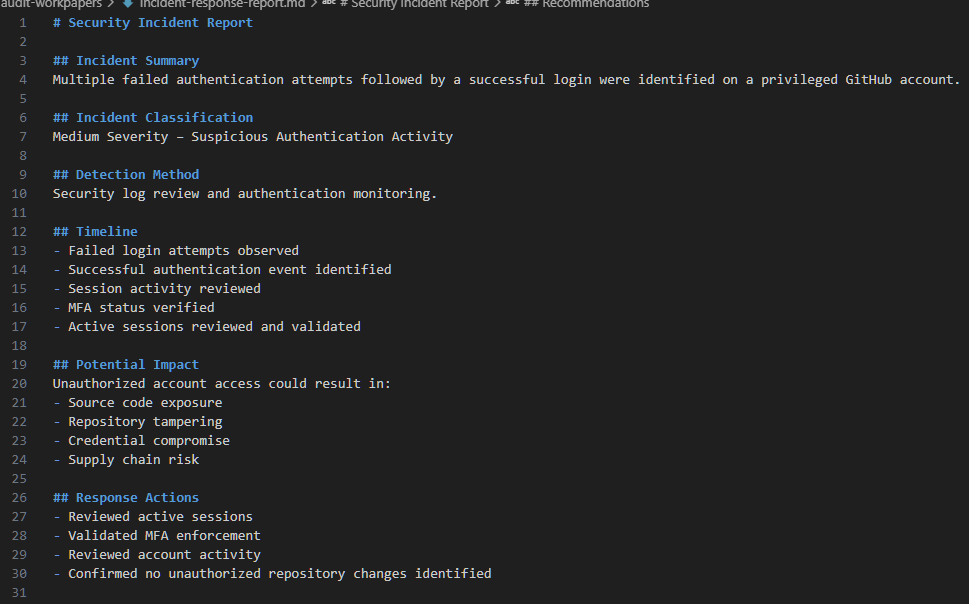

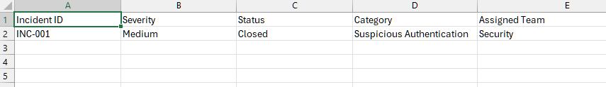

## Step 9: Vendor Risk Management Review

Performed a third-party vendor risk assessment aligned with SOC 2 and NIST supply chain risk management controls.

Created and reviewed:
- Vendor inventory
- Risk classifications
- Criticality assessments
- Security review tracking

Documented cybersecurity risks associated with SaaS providers and identified recommendations to strengthen vendor governance and third-party risk management processes.

### Screenshots

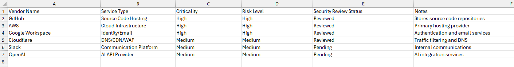

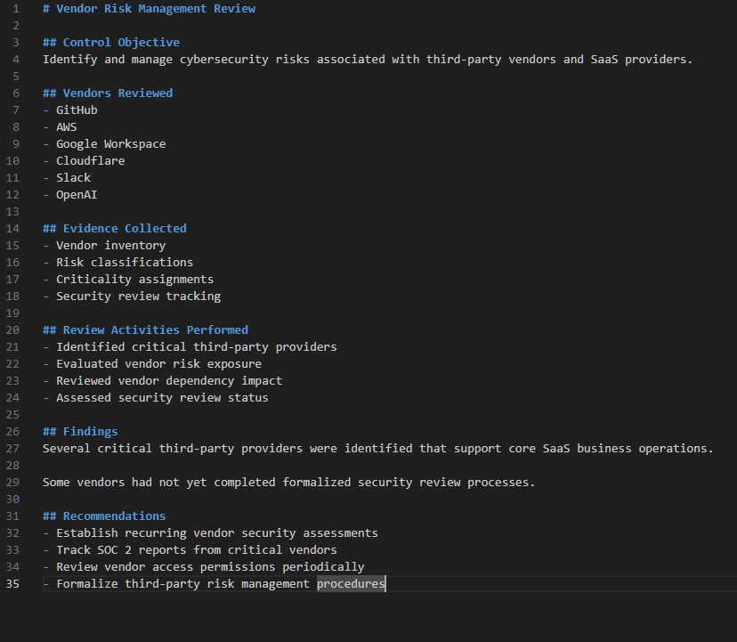

## Step 10: Final Audit Findings Report

Completed a simulated SaaS security audit aligned with SOC 2 and NIST CSF 2.0 frameworks.

Conducted reviews across:
- Access control
- Logging and monitoring
- Asset management
- Vulnerability management
- Security governance
- Incident response
- Vendor risk management

Produced a formal audit findings report containing:
- Executive summary
- Risk analysis
- Security findings
- Remediation recommendations
- Governance maturity observations

This project simulated real-world audit readiness and security assessment activities commonly performed by cybersecurity analysts and GRC teams within SaaS environments.

### Screenshots

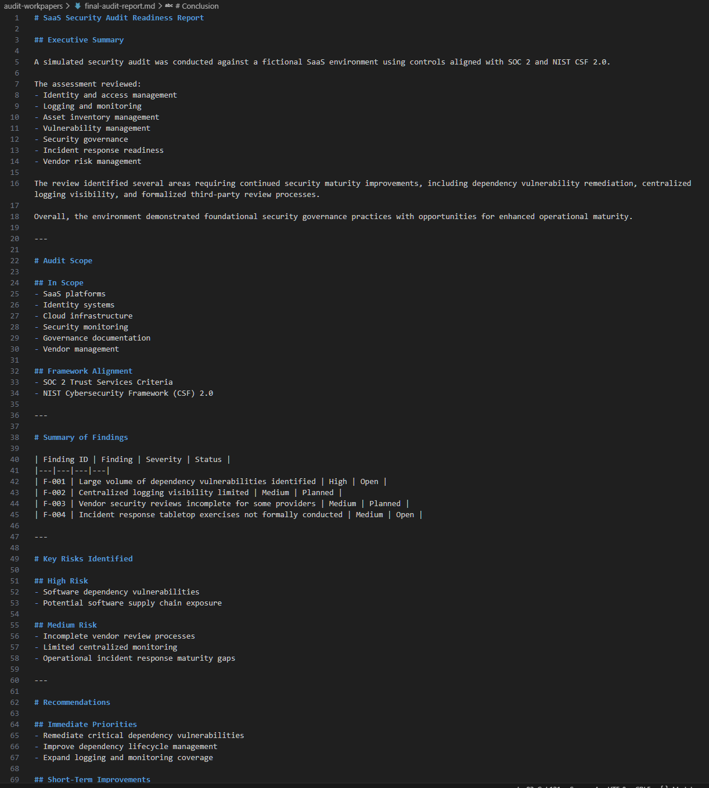

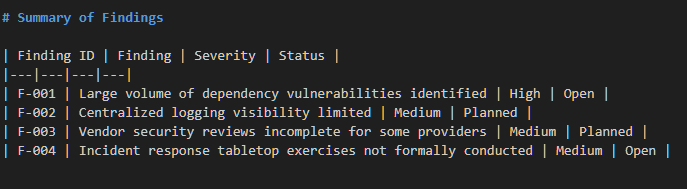

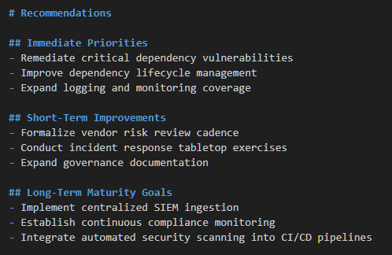