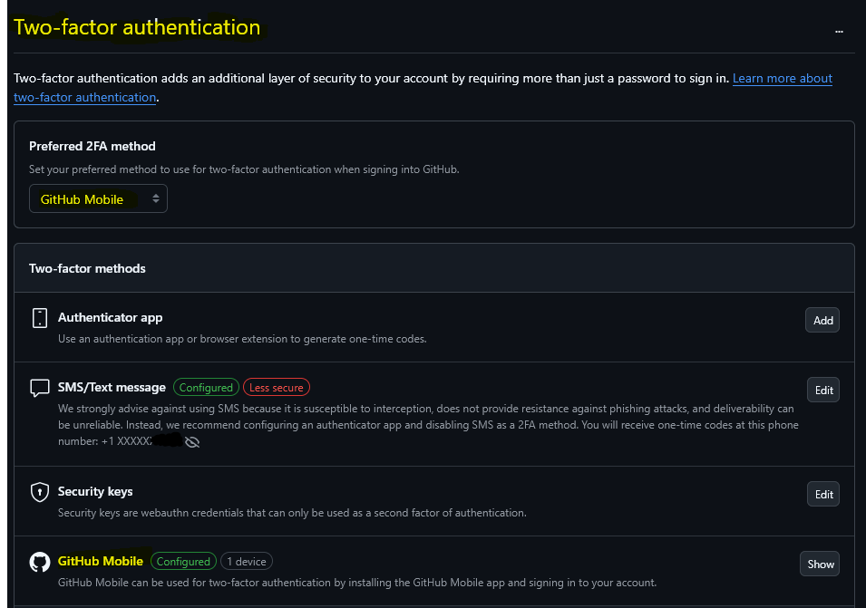
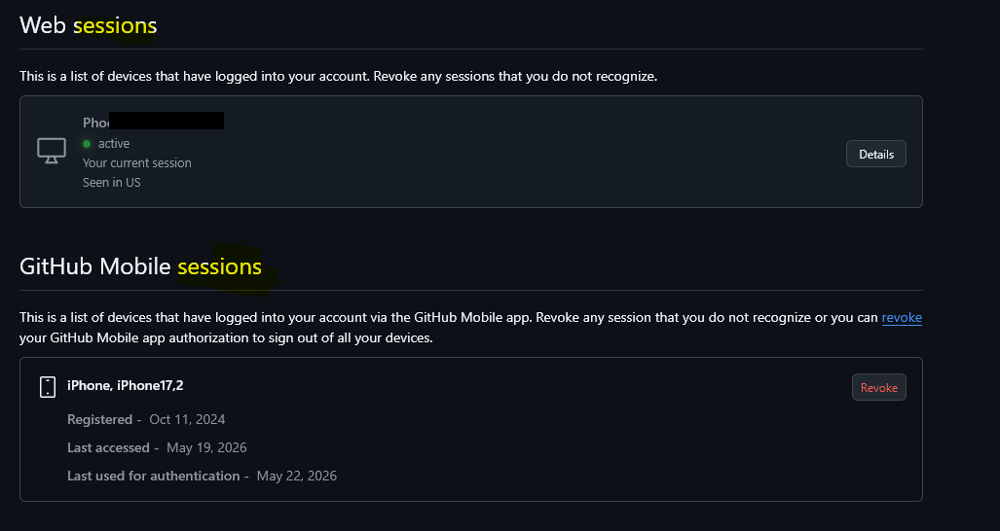

# Access Control Review

**Framework Alignment**
- SOC 2
- NIST CSF 2.0

## Control Objective
Ensure logical access to systems and SaaS platforms is restricted to authorized users and protected with strong authentication controls.

## Systems Reviewed
- GitHub
- Email Provider
- Cloud Provider (if applicable)

## Controls Reviewed
- Multi-factor authentication (MFA)
- Active session monitoring
- Account recovery methods
- Administrative privilege assignment
- Password security settings

## Evidence Collected
- MFA enabled screenshots
- Session/device review screenshots
- Security settings screenshots

## Evidence Screenshots

### MFA Enforcement

### Active Sessions Review

### Security Settings Review

## Findings
No critical findings identified during the review.

## Recommendations
- Enforce phishing-resistant MFA where possible
- Review active sessions regularly
- Remove unused devices/accounts promptly

