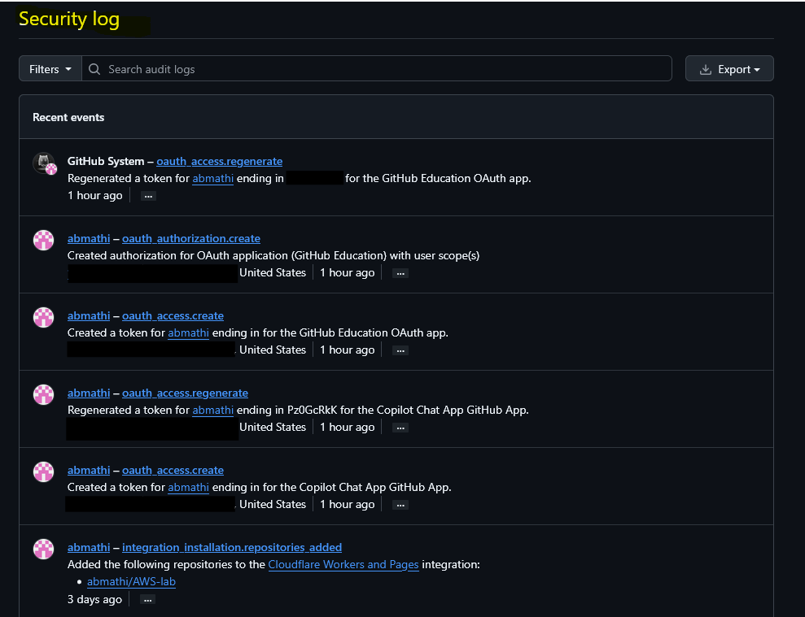

# Logging and Monitoring Review

**Framework Alignment**
- SOC 2
- NIST CSF 2.0

## Control Objective
Ensure security-relevant events are logged, monitored, and reviewed to support threat detection and incident investigation.

## Systems Reviewed
- GitHub Security Log
- Identity Provider Activity Logs
- Cloud Audit Logs (if applicable)

## Evidence Collected
- Authentication event logs
- Security activity history
- Login/session activity
- MFA-related events

## Evidence Screenshots

### Security Log Overview

### Authentication Events

### MFA Security Events

## Review Activities Performed
- Reviewed recent login activity
- Reviewed security-related account changes
- Validated audit logging visibility
- Checked for suspicious or unauthorized events

## Findings
No suspicious activity identified during review.

## Recommendations
- Centralize logging into a SIEM platform
- Configure alerting for suspicious logins
- Enable long-term log retention
- Review privileged account activity regularly

